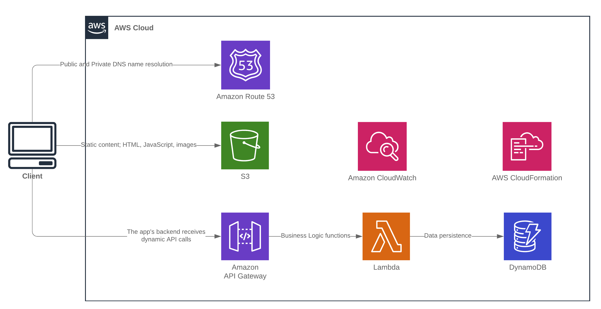

# AWS Serverless Toy Checklist

AWS Serverless Toy Checklist is a sample application that demonstrates the creation and interaction of the followng AWS services:

| Service        | Purpose           |
| ------------- | -------------|
| Route53 | Domian name registration and resolution |
| S3 | Buckets for static website hosting |
| DynamoDB | NoSQL database for data persistence |
| SAM | Serverless Application Model comprised of an API Gateway and integrated Lambda functions |
| Cloudformation | Infrastructure as Code. Nested templates which are used to create and destroy the stack |

This project has been created mainly for reference and review purposes. With that said, it is a functioning project so if you do decide to use it to create infrastrcuture in AWS just make sure that you keep an eye on the resources being created (mentioned above) so that you can manage your costs.

# Architecture overview

A visual overview of the project architecture is provided below.

# Stack Resources

The following AWS resources are created by the project.

* AWS::ApplicationAutoScaling::ScalableTarget
* AWS::ApplicationAutoScaling::ScalingPolicy
* AWS::DynamoDB::Table
* AWS::Route53::RecordSetGroup
* AWS::S3::Bucket
* AWS::Lambda::Function
* AWS::Lambda::Permission
* AWS::IAM::Role
* AWS::ApiGateway::RestApi
* AWS::ApiGateway::Deployment
* AWS::ApiGateway::Stage

# Points of interest

## DynamoDB

* Upload data items to DynamoDB using `batch-write-item`; see [create-stack.sh](dynamodb/create-stack.sh)

## Route53

* Register a domain with AWS from the command line; see [register-domain.sh](route53/register-domain.sh)
* Delete DNS domain resources from the command line; see [delete-domain-resources.sh](route53/delete-domain-resources.sh)

## SAM

* Add CORS support to a Lambda integration response; see [index_starwars.js](sam/src/index_starwars.js)

## S3

* Delete versions of S3 objects from the command line; see [remove-s3-objects.sh](s3/remove-s3-objects.sh)

# Prerequisites

* Installation of [AWS CLI v2](https://docs.aws.amazon.com/cli/latest/userguide/install-cliv2.html)
* Installation of [git](https://git-scm.com/)
* A [Bash](https://www.gnu.org/software/bash/) interpreter
* A publically accessbile [domian registered with Route53](https://docs.aws.amazon.com/Route53/latest/DeveloperGuide/registrar.html)
* Cloudformation templates available in an S3 bucket (the templates are provided with the project)
* S3 bucket in order to upload the packages Lambda functions

# Getting the project and creating the stack

## Getting the project

1. Navigate to the location where you wish to download the project
2. Execute a git clone; `git clone http://GIT_URL aws-serverless-toy-checklist`
3. Navigate to the cloned project; `cd aws-serverless-toy-checklist`

## Uploading the Cloudformation templates
1. Create an S3 bucket (or reuse an exisiting bucket) in order to store the Cloudformation templates
2. Upload the following Cloudformation templates to the S3 bucket:
	* parent-stack.yml
	* dynamodb/dynamodb-stack.yml
	* route53/route53-stack.yml
	* s3/s3-stack.yml
	* sam/sam-stack.yml

## Configuring the scripts and templates
1. Open the file `./create-stack.sh` and adjust the following variables to reflect your environment:
	* `CFN_RESOURCES_BUCKET=<S3_BUCKET_WITH_CFN_TEMPLATES>`
	* `DNS_DOMAIN=<PUBLIC_DOMAIN_NAME>`
2. Open the `parent-stack.yml` template and adjust the `TemplateURL` to reflect the path to your S3 bucket prefix

## Running the stack
3. Execute the bash creation script; `./create-stack.sh`
3. Open the AWS Console and navigate to the Cloudformation service
4. Verify the execution of the stacks. The project is composed of the following stacks:
	* `toychecklist` - this is the parent stack
	* `toychecklist-dynamodb` - this is the nested dynamodb stack
	* `toychecklist-route53` - this is the nested route53 stack
	* `toychecklist-s3` - this is the nested s3 stack
	* `sam-stack` - this is an independent stack that creates the API Gateway and Lambda function resources
5. Once the stack has been created, navigate to your domain name and see if the website is available (this may take a few minutes for the DNS names to be published)

Following the completion of the `./create-stack.sh` script, several new scripts will have been created dynamically as part of the installation.

| Script        | Purpose           |
| ------------- | -------------|
| [destroy-stack.sh](destroy-stack.sh) | Destroys the projects infrastructure - this will remove all the paid resources that were created by the project. **WARNING** - all data created by the project will be lost |
| [dns-records.json](route53/dns-records.json) | Contains the `A` and `CNAME` record resources that were created during installation in order to remove them during environment destruction |
| [dataload-1.json](dynamodb/dataload-1.json) | JSON files containing the DynamoDB data entities to be persisted |
| [sam-stack-output.yml](sam/sam-stack-output.yml) | SAM configuration file created during the sam `package` phase and used during the sam `deploy` phase |
| [properties.js](s3/website/js/properties.js) | Contains the dynamically inject properties of the deployed API Gateway URL and the URL of the S3 Static Hosting Bucket |

# Destroying the stack

The stack contains a `destroy-stack.sh` script which will delete all of the resouces created, including removing the `A` and `CNAME` records created in the publically hosted DNS zone as well as removing all content from the S3 Bucket used for website hosting.

1. To destroy the stack, execute: `./destroy-stack.yml` 
2. Open the AWS Console and navigate to the Cloudformation service
3. Verify the deletion of the stacks. The project is composed of the following stacks:
	* `toychecklist` - this is the parent stack
	* `toychecklist-dynamodb` - this is the nested dynamodb stack
	* `toychecklist-route53` - this is the nested route53 stack
	* `toychecklist-s3` - this is the nested s3 stack
	* `sam-stack` - this is an independent stack that creates the API Gateway and Lambda function resources
4. Once the stack has been destroyed, navigate to your domain name and make sure that the website is not available.